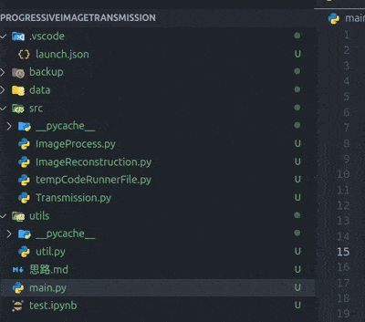
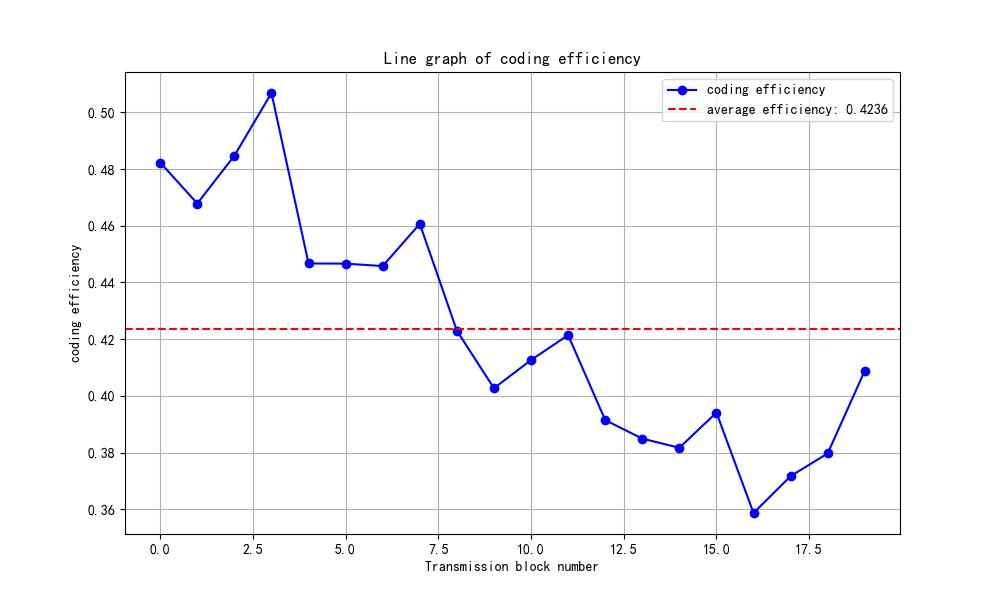
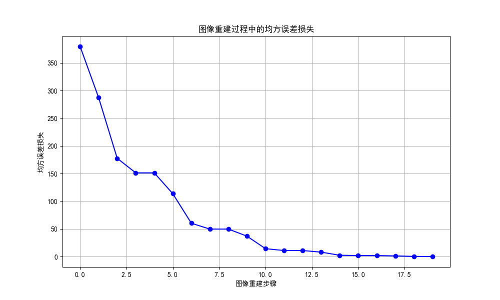

# 数字图像处理大作业 -- 渐进式图像传输
## 作业要求
课题：图像渐进显示系统的设计与实现              
一位来自一所著名的研究性医院的放射学家最近参加了一次医学会议。在会上展示了一种可以通过标准电话线路传输4096×4096大小的12位数字化X光图像的系统。这个系统将图像以一种渐进的技术得到的一种压缩形式的传送图像。这种技术可以第一次在观察站上重构出X光的相当好的近似图像，然后经过逐步细化得到一幅高分辨率的图像。  产生第一次近似图像的数据传输要花5到6秒的时间。在接下来的一分钟之内，每隔5到6秒（平均）会进行一次细化。重构X光图像的过程中，第一次和最后一次细化分别对图像具有最大的和最小的影响。
## 解题思路
1. 将空域通过小波变换变换到频域， 采用多级小波变换，将第$i$次小波变换结果的`LL`分量继续进行小波变换从而实现图像在频域上的分解
2. 利用传输类模拟电话线传输过程
   1. 考虑到当前电话线普遍规格为**4类双绞线**， 该类电缆的**传输频率为20MHz**,用于**语音传输和最高传输速率16Mbps的数据**，传输编码采用**JPEG2000**编码， 对小波变换的亲和性高
   2.  每次传输一级小波变换中的某一个分量， 按照低频->高频的顺序分次传输
   3.  对于4096*4096， 12bit的图片来说，最大的一个分量为传播第一次小波变换的结果的频域信息，其传输的数据大小为：$2048×2048×1.5Byte=6,291,456Byte=50,331,648bit=50.33Mb$, 在编码效率为$40\%$的情况下数据量大小为$20.132 Mbps$
   4.  按照每4秒更新一次图像来看， 4秒内传输的数据量大小为$16Mbps * 4s = 64 Mb$， 因此可以实现传输
3.  实现根据频域信号重建原图像
    1.  首先需要初始化频域信息， 要将还没有接收到频域信息的位置初始化为0， 表示当前频域位置没有信息
    2.  然后在每次接收到频域信息时， 都从底层向上进行小波逆变换：
        1.  先根据$i$级的的$LL_i, LH_i, HL_i, HH_i$得到$LL_{i-1}$
        2.  然后在根据$i - 1$级的的$LL_{i-1}, LH_{i-1}, HL_{i-1}, HH_{i-1}$得到$LL_{i-2}$
        3.  以此类推， 直到恢复出原始图像

## Requirements
新建虚拟环境
```bash
conda env create -f environment.yaml
conda activate DigitImageProcessing
```
## Testing
只需要运行下面代码
```bash
sh test.sh
```
## 结果示例
### 示例图片


### 编码效率

### 重建图像损失



